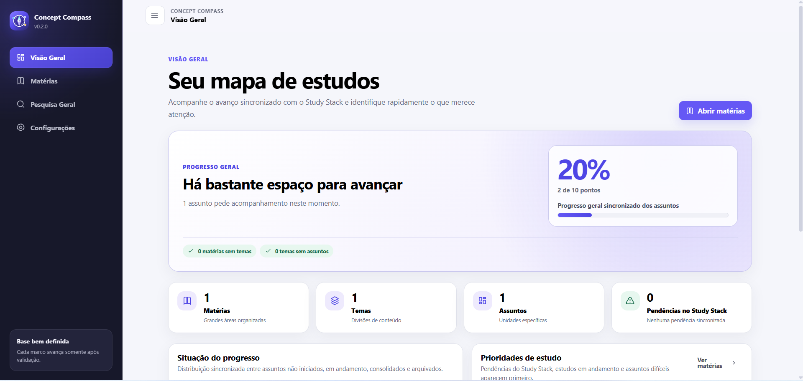

# Concept Compass 🧭

**Organize o que estudar. Enxergue onde está. Continue pelo próximo passo.**

O **Concept Compass** é uma aplicação web local-first para organizar conteúdos em **Matéria → Tema → Assunto** e acompanhar, de forma integrada, o progresso registrado no **Study Stack**.

> **Versão publicada:** `v0.2.0`  
> **Aplicação:** https://viniciusidney.github.io/concept-compass/



## Visão geral

O Concept Compass funciona como o mapa estrutural do ecossistema de estudos. Ele mantém a organização dos conteúdos, enquanto o **Study Stack é a fonte única do progresso de estudo**.

A aplicação permite estruturar Matérias, Temas e Assuntos, navegar pela hierarquia, pesquisar conteúdos, arquivar ou reorganizar itens e abrir o contexto correspondente no Study Stack pela **mesma aba**.

O projeto é totalmente local-first: os dados ficam no navegador, sem necessidade de conta, servidor ou banco de dados remoto.

## Principais recursos

- organização hierárquica em **Matéria → Tema → Assunto**;
- criação, edição, exclusão, arquivamento e restauração;
- reordenação de conteúdos e movimentação entre estruturas;
- Visão Geral com progresso, prioridades e atividade recente;
- Pesquisa Geral com contexto de estudo e estado sincronizado;
- integração bidirecional com o Study Stack;
- backup JSON, importação validada e recuperação de dados;
- temas Claro, Escuro e Seguir sistema;
- interface responsiva e navegável por teclado;
- armazenamento local com compatibilidade entre versões anteriores.

## Integração com o Study Stack

O Concept Compass envia ao Study Stack o contexto da Matéria, Tema e Assunto utilizando o contrato `1.0.0`.

O progresso oficial é publicado pelo Study Stack em:

```text
study-stack:integration:progress:v1
```

A exclusão vinculada utiliza:

```text
study-stack:integration:deletion-commands:v1
```

O Concept Compass apenas lê e apresenta esse estado. Ele não cria um progresso paralelo nem usa progresso local como fallback.

### Fluxo

```text
Concept Compass
      ↓
Matéria → Tema → Assunto
      ↓
Study Stack
      ↓
0–10 + etapas + pendências + atividade
      ↓
Concept Compass apresenta o resultado
```

## Estrutura dos dados

O schema estrutural atual é o **schema v3**.

A aplicação preserva IDs estáveis e mantém compatibilidade com backups antigos válidos. Dados das versões anteriores passam pela cadeia de migração até o formato atual, enquanto campos antigos de progresso são descartados sem gerar registros artificiais no Study Stack.

```text
schema v1
   ↓
schema v2
   ↓
schema v3
```

## Tecnologias

O projeto utiliza **HTML5, CSS3 e JavaScript com ES Modules**, sem dependências de execução.

A persistência é feita com `localStorage`, e o projeto inclui testes automatizados, ESLint, Prettier e verificações próprias de release.

## Executar localmente

Requisitos:

- Node.js `20` ou superior;
- npm.

```bash
npm ci
npm run serve
```

Depois, acesse o endereço informado pelo servidor local.

Para executar o portão técnico completo:

```bash
npm run release:check
```

## Desenvolvimento integrado

Como a sincronização entre Concept Compass e Study Stack usa `localStorage`, os dois aplicativos precisam compartilhar protocolo, host e porta.

Uma configuração local possível é:

```text
http://localhost:4173/concept-compass/
http://localhost:4173/study-stack/
```

Durante testes integrados, evite misturar `localhost`, `127.0.0.1`, IP local, GitHub Pages ou portas diferentes.

## Qualidade e validação

O projeto possui testes automatizados para domínio, migrações, integração, navegação, compatibilidade, identidade, desempenho e fronteiras contra a reintrodução de progresso manual.

O comando:

```bash
npm run release:check
```

executa o conjunto de testes, análise estática, conferência de formatação e verificações estruturais do projeto.

## Compatibilidade da renomeação

O nome atual do produto é **Concept Compass**, mas parte da identidade técnica histórica foi preservada para evitar quebra de dados existentes.

Por isso:

- o pacote continua usando o identificador `organizador-de-conteudos`;
- as chaves históricas `organizador-conteudos:*` permanecem compatíveis;
- backups antigos compatíveis continuam importáveis;
- IDs e relações existentes não são recriados por causa da mudança de marca.

## Documentação pública

A documentação mantida no repositório é voltada para entendimento e uso do produto:

- `docs/manual-do-usuario.md`
- `docs/integracao-study-stack.md`

Documentos internos de planejamento, publicação, validação e testes manuais são mantidos separadamente do repositório público.

## Estado atual

A `v0.2.0` consolidou a integração com o Study Stack. A branch `main` inclui correções posteriores à release, como navegação na mesma aba e resolução do Study Stack na mesma origem durante desenvolvimento local.

O service worker permanece sem registro na versão atual, evitando cache persistente sem um fluxo de atualização previamente validado.

## Autor

**Vinícius Sidney**  
Estudante de Informática e desenvolvedor web em formação.
